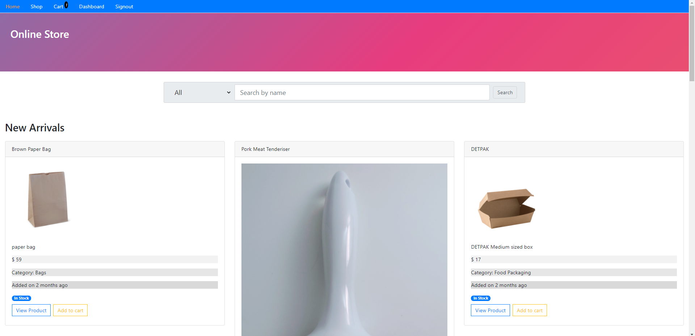
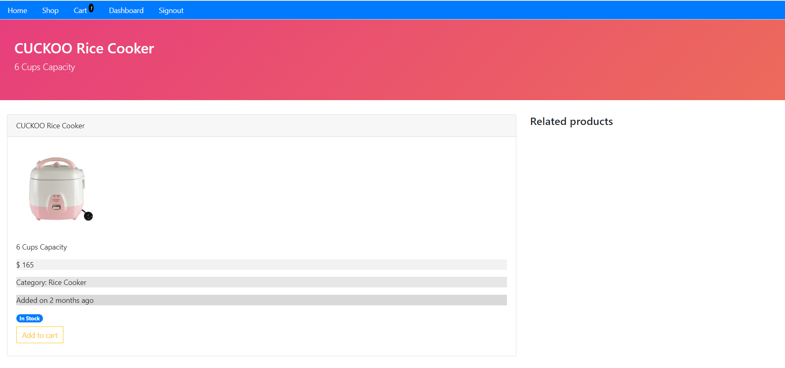

This is the front-end of the e-commerce application. This front-end was developed using ReactJS.

To clone and run this project, you'll need Git and Node.js (which comes with npm) installed on your computer. From your command line:

# Clone this repository
$ git clone https://github.com/peterannguyenn/ecommerce-online-store-frontend.git

# Go into the repository
$ cd ecommerce-online-store-frontend

# Install dependencies
$ npm install

# create .env file
Using your editor, create an .env file and paste the following:
REACT_APP_API_URL=http://localhost:8000/api

# Start
$ npm start

# Images

